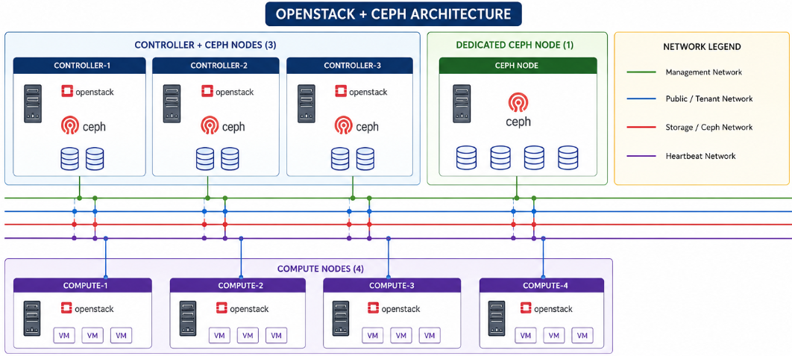

# Design

## 3. Hardware & Node Configuration

This section provides a comprehensive and detailed description of the
hardware specifications, node roles, and configuration strategy for the
new 8-node OpenStack cluster. Particular emphasis is placed on the Ceph
storage subsystem, which forms the foundational storage layer for the
entire cloud environment. The design decisions in this section directly
influence the performance, availability, scalability, and reliability of
all storage-related operations across Cinder, Glance, Nova, and external
integration's.

### 3.1 Overall Cluster Architecture Summary

The OpenStack cluster consists of **8 physical nodes** configured in a
multi-controller high-availability setup. The nodes are divided into
three distinct role categories to balance control plane functions,
storage capacity, and compute power:

- **3 Nodes**: Controller + Ceph (hyper-converged roles)

- **1 Node**: Dedicated Ceph storage node

- **4 Nodes**: Pure Compute nodes

This distribution allows us to achieve Ceph quorum and redundancy with 4
storage-capable nodes while maintaining operational efficiency within
the constrained 8-node footprint.

**Hardware Configuration Overview** (as per project specification):

- 4 nodes with 16 cores and 64 GB RAM (primarily used
  > for Controller + Ceph roles)

- 4 nodes with 16 cores and 96 GB RAM (primarily used
  > for Compute roles)

This results in a total of **128 CPU cores** and
**640 GB RAM** across the cluster. The storage design is built around
the 4 Ceph nodes, which will host all OSD daemons and provide the
distributed, replicated storage backend.

### 3.2 Detailed Ceph Storage Node Configuration (Primary Focus)

The Ceph storage layer is the most critical component of this
deployment. All persistent data (block volumes, images, snapshots, and
objects) will reside on these 4 nodes. Therefore, careful hardware
planning is essential.

> **3.2.1 Controller + Ceph Nodes (Nodes 1, 2, and 3)**

These three nodes run both OpenStack control plane services and Ceph
storage daemons simultaneously. This hyper-converged approach optimizes
hardware utilization but requires careful resource management.

- **CPU**: 16 cores per node. These cores must support control plane
  > workloads (Nova API, Neutron, Keystone, Cinder, Galera, RabbitMQ,
  > etc.) as well as Ceph OSD processing, replication, and recovery
  > operations.

- **RAM**: 64 GB per node. This memory must be shared between OpenStack
  > services and Ceph BlueStore metadata caching. OSD RAM consumption
  > (typically 2–4 GB per OSD) must be closely monitored.

- **OS Boot Disk**: Recommended 500 GB enterprise SSD in RAID1
  > configuration for maximum reliability. This disk hosts the operating
  > system, container images, logs, and Ceph configuration files.

- **OSD Disks**: To be finalized based on procurement. Each node should
  > host multiple OSDs to contribute meaningfully to the cluster’s
  > capacity and performance.

- **Networking**: Each node must have multiple high-speed Network
  > Interface Cards (NICs) with bonding support. Connectivity to both
  > **Storage Public Network** and **Storage Cluster Network** is
  > mandatory.

> **3.2.2 Dedicated Ceph Node (Node 4)**

This node is purpose-built to provide additional storage capacity and
help balance data distribution across the Ceph cluster.

- **CPU**: 16 cores.

- **RAM**: 64 GB (aligned with other Ceph
  > nodes).

- **OS Boot Disk**: Dedicated SSD recommended, kept completely separate
  > from OSD storage to avoid any performance interference.

- **OSD Disks**: Expected to carry the largest storage allocation among
  > the four Ceph nodes (reference to previous 8 TB planning). This node
  > should be equipped with the highest number of disks to act as a
  > capacity anchor.

- **Networking**: Same high-bandwidth, redundant connectivity as the
  > other Ceph nodes, with emphasis on Storage Cluster Network
  > performance.

### 3.3 Compute Nodes (Nodes 5–8)

These four nodes are dedicated to running virtual machine workloads:

- **CPU**: 16 cores per node.

- **RAM**: 96 GB per node (higher allocation to support guest VM memory
  > requirements).

- **Local Disk**: 2 TB SSD for hypervisor OS and optional local
  > ephemeral storage.

- **Ceph Role**: Act purely as Ceph clients (RBD consumers). They do not
  > run any Ceph daemons.

### 3.4 Ceph OSD Layout and Storage Best Practices

Since Ceph is the primary storage system, the following design
principles are strictly recommended:

- One OSD daemon per physical disk (best practice for stability and
  > performance).

- Use of **BlueStore** as the OSD backend (modern default with excellent
  > performance characteristics).

- Separation of WAL/DB volumes on fast media (NVMe or SSD) when using
  > HDDs for main capacity.

- All Ceph nodes must have dedicated OS boot disks - sharing OS and OSD
  > storage on the same drives is strongly discouraged.

- Preference for a mixed disk strategy (SSD/NVMe for high-performance
  > pools and HDDs for capacity pools) once final hardware
  > specifications are received.

### 3.5 Network Integration for Ceph Storage

Ceph traffic will utilize multiple networks from the defined
architecture:

- **Storage Public Network**: Used for all client communication
  > (OpenStack services to Ceph).

- **Storage Cluster Network**: Dedicated for OSD-to-OSD replication,
  > recovery, and heartbeats (high bandwidth and low latency critical).

- **Enterprise External Storage Network (iSCSI)**: For iSCSI gateway
  > traffic.

- **Enterprise External Storage Network (NAS)**: For CephFS and NFS
  > access.

All Ceph nodes require redundant, bonded high-speed interfaces on these
storage networks to ensure performance and fault tolerance.

### 3.6 Time Synchronization (Chrony)

Accurate, synchronized time across all 8 nodes is a hard requirement for this
design, not an optional hardening step. Ceph Monitor quorum depends on clock
skew staying within Ceph's default tolerance (~50ms); OpenStack Keystone
token validation, Galera cluster operation, and TLS certificate checks are
all similarly time-sensitive. Log correlation across nodes during incident
response also depends on synchronized clocks.

**Design approach:**

- **Chrony** (`chronyd`) is used as the NTP implementation on all 8 nodes,
  replacing the older `ntpd` — it converges faster after boot and handles
  intermittent network connectivity better, both relevant in a
  private/on-prem cluster.
- One or two Controller nodes (Node 1 and Node 2) are configured as internal
  **stratum-2 time sources**, synchronizing from external upstream NTP
  servers (e.g. `pool.ntp.org`, or an organization-internal time source if
  available).
- All remaining nodes (Node 3, Node 4, and Compute Nodes 5–8) point to these
  internal sources rather than reaching out to the internet directly —
  reducing external dependency and keeping time traffic on the internal
  Management Network.
- Firewall rules must permit **UDP port 123** between all nodes and their
  configured time sources.

**Validation:**

- `chronyc tracking` and `chronyc sources` should be checked on each node
  post-install to confirm synchronization and acceptable offset.
- Clock skew should be added as a monitored metric (see section 9.3), since
  Ceph will raise `HEALTH_WARN` automatically if skew exceeds tolerance.

## 4. Network Architecture

The network architecture forms a critical foundation for the Ceph
storage subsystem within this OpenStack deployment. As a distributed
storage platform, Ceph generates substantial client and internal traffic
that must be supported with high bandwidth, low latency, redundancy, and
strict isolation. This section details the network design specifically
optimized for the Ceph cluster operating across four nodes in the
eight-node environment.

### 4.1 Ceph Network Design Principles

The network design follows established best practices for Ceph
deployments:

- Complete separation of client-facing traffic from internal replication
  > traffic.

- High throughput and low latency paths to support production workloads.

- Full redundancy to eliminate single points of failure.

- Logical isolation using VLANs to enhance security and performance.

### 4.2 Complete List of Networks

The following 11 networks are defined for the environment:

- Out of Band Network (Not part of Cloud Network)

- Management Network (Not part of Cloud Network)

- Public API Network

- Private API Network

- Tunnel Network (Neutron)

- Self Service Network

- Storage Public Network

- Storage Cluster Network

- External Network

- Enterprise External Storage Network through iSCSI

- Enterprise External Storage Network through NAS

### 4.3 Primary Networks for Ceph Storage

**Storage Public Network**

This network functions as the primary front-end interface for Ceph. It
carries all client traffic from OpenStack services, including Cinder
block volumes, Glance images, Nova ephemeral disks, and external access
via iSCSI gateways. High bandwidth and low latency are essential on this
network.

**Storage Cluster Network**

This dedicated back-end network is used exclusively for internal Ceph
operations. It transports OSD-to-OSD replication, recovery, back-fill,
and heartbeat traffic. During node or disk failure events, this network
experiences the highest load and must be sized accordingly.

**Enterprise External Storage Networks**

- **iSCSI Network**: Dedicated segment for Ceph iSCSI gateway traffic,
  > enabling block-level access for legacy enterprise systems.

- **NAS Network**: Dedicated segment for CephFS with NFS-Ganesha,
  > providing file-level shared storage access.

### 4.4 Technical Configuration Specifications

- **VLAN Segregation**: All networks utilize dedicated VLANs for logical
  > separation, security, and traffic isolation.

- **IP/Subnet Assignments**: Unique subnets are allocated to each
  > network. The detailed IP addressing plan will be finalized during
  > the implementation phase.

- **MTU Configuration**: Jumbo frames with an MTU of 9000 are enabled on
  > the Storage Public Network, Storage Cluster Network, iSCSI Network,
  > and NAS Network to optimize throughput and reduce CPU overhead.

- **Bonding for Redundancy**: LACP (Link Aggregation Control Protocol)
  > bonding is implemented on all critical storage interfaces to provide
  > link-level redundancy and increased aggregate bandwidth.

### 4.5 Network Topology and Traffic Flows

A comprehensive **Network Topology Diagram** will be included in this
document. The diagram will illustrate:

- All 11 networks with corresponding VLANs.

- Connectivity for the four Ceph nodes.

- Major traffic flows, clearly distinguishing client I/O (Storage Public
  > Network) from internal replication (Storage Cluster Network).

- Bonding configurations and redundant paths.

### 4.6 Implementation and Validation Considerations

The network design ensures that the Ceph storage layer receives
dedicated, high-performance connectivity. Prior to deployment, the
following validation activities will be performed:

- Verification of switch capacity and buffering capabilities.

- Testing of bonded interface failover scenarios.

- Performance bench marking of storage networks under simulated load.

- Documentation of VLAN assignments, firewall rules, and IP schemes.

This network architecture provides the necessary performance, isolation,
and resilience required for a production-grade Ceph storage deployment
in the OpenStack environment.

## 5. Ceph Cluster Design

### 5.1 Design Overview

This section provides a comprehensive definition of the internal Ceph
cluster architecture. It covers daemon placement, CRUSH map topology,
pool structure, and baseline configuration parameters. The design is
directly aligned with the confirmed 8-node OpenStack topology and
utilizes exactly four Ceph-capable hosts - Node 1, Node 2, Node 3, and
Node 4 - as the complete OSD estate. No additional storage nodes are
assumed at this stage.

The Ceph cluster is designed to deliver high availability, strong
performance, and horizontal scalability while integrating seamlessly
with the OpenStack services. All persistent and semi-persistent data for
Cinder, Glance, Nova, and future object/file services will be stored and
managed by this Ceph cluster.

### 5.2 Daemon Placement

The placement of Ceph daemons has been carefully planned to balance high
availability, resource utilization, and operational simplicity.

| **Daemon** | **Count**             | **Placement**                     | **Rationale**                                                                                                                                                                                                                                                                                                             |
|------------|-----------------------|-----------------------------------|---------------------------------------------------------------------------------------------------------------------------------------------------------------------------------------------------------------------------------------------------------------------------------------------------------------------------|
| MON        | 3                     | Node 1, Node 2, Node 3            | An odd number of monitors is required to maintain Paxos quorum. Three monitors allow the cluster to tolerate the failure of one monitor while maintaining quorum and normal cluster operations. Node 4 is intentionally excluded from MON duties to avoid placing quorum-critical services on the dedicated storage node. |
| MGR        | 2(Active/StandBy)     | Node 1 (Active), Node 2 (Standby) | Two Manager daemons provide high availability for cluster management. The active Manager handles monitoring, dashboard, and orchestration tasks, while the standby Manager automatically takes over if the active instance fails.                                                                                         |
| OSD        | One per physical disk | Node 1, Node 2, Node 3, Node 4    | One Object Storage Daemon (OSD) is deployed for each physical storage disk using the BlueStore storage backend. This configuration provides optimal performance, efficient storage utilization, and simplifies data recovery. The final number of OSD daemons depends on the storage disks allocated to each node.        |
| MDS        | As Required           | Decision Pending                  | The Metadata Server (MDS) is required only when CephFS is deployed to provide a distributed file system. Since CephFS is optional for this deployment, the placement and number of MDS daemons will be finalized if shared file services are included in the project scope.                                               |
| RGW        | As Required           | Decision Pending                  | The RADOS Gateway (RGW) is required only if object storage services using S3 or Swift APIs are implemented. Deployment location and the number of RGW instances will be determined once object storage requirements are confirmed.                                                                                        |

**Note**: MON, MGR, and OSD placement are finalized and ready for
implementation. MDS and RGW placement remain open items pending final
confirmation of file and object storage requirements.

### 5.3 CRUSH Map

#### 5.3.1 Failure Domain

The CRUSH map is configured with a **host-level failure domain**. With
four OSD hosts available, the system ensures that each placement group’s
three replicas are distributed across three different physical nodes.
This configuration guarantees that the failure of any single host
affects only one replica of any object, maintaining data availability.

#### 5.3.2 Rack Awareness

Rack-level failure domain is not implemented in the current design.
Introducing rack awareness with only four OSD hosts would not provide
meaningful additional protection and could reduce placement flexibility.
Rack awareness will be evaluated in future expansions when the cluster
grows and spans multiple physical racks.

#### 5.3.3 Custom CRUSH Rules

| **Rule Name**          | **Purpose**                                                                                              | **Applies To**                                                                                  |
|------------------------|----------------------------------------------------------------------------------------------------------|-------------------------------------------------------------------------------------------------|
| **replicated_hdd**     | Restricts object placement to the HDD device class, ensuring that data is stored only on HDD-based OSDs. | Capacity-oriented and bulk storage pools when a mixed SSD/HDD storage architecture is deployed. |
| **replicated_ssd**     | Restricts object placement to the SSD device class to provide lower latency and higher I/O performance.  | High-performance storage pools, such as Cinder volumes, when SSD tiering is implemented.        |
| **replicated_default** | Uses the default CRUSH rule without restricting placement to a specific device class.                    | Deployments where all OSDs use the same storage media (uniform disk configuration).             |

The requirement for device-class-specific rules depends on the final
decision regarding SSD, HDD, or mixed disk configuration across the Ceph
nodes.

### 5.4 Pool Design

The following pools will be created to support different OpenStack
workloads:

| **Pool Name** | **Consumer**  | **Purpose**                                                                                   | **Replication** | **PG Autoscale** |
|---------------|---------------|-----------------------------------------------------------------------------------------------|-------------|------------------|
| volumes       | Cinder        | Stores persistent block volumes attached to virtual machines.                                 | 3×          | Enabled          |
| images        | Glance        | Stores virtual machine boot images and templates used for instance provisioning.              | 3×          | Enabled          |
| vms           | Nova          | Stores ephemeral instance disks when Nova is configured to use Ceph RBD as the backend.       | 3×          | Enabled          |
| backups       | Cinder Backup | Stores volume backups and snapshots for recovery and data protection.                         | 3×          | Enabled          |
| .rgw.root     | RGW           | Stores metadata and configuration information required by the RADOS Gateway service.          | 3×          | Enabled          |
| .rgw.\*       | RGW           | Stores S3- and Swift-compatible object data and related metadata for object storage services. | 3×          | Enabled          |

**PG Management Strategy**:

Instead of manually calculating placement group counts,
pg_autoscale_mode = on will be enabled for all pools. This modern Ceph
feature automatically adjusts the number of placement groups based on
cluster size and data volume, reducing the risk of misconfiguration and
simplifying long-term management.

This pool design provides a solid foundation that can be expanded as
storage requirements grow.

### 5.5 [Cephadm](https://docs.ceph.com/en/latest/cephadm/) — Deployment & Orchestration Tool

Cephadm is Ceph's own native cluster lifecycle management tool,
introduced in the Octopus(15 .2.0) release as the recommended
installation method for any Ceph cluster not running inside Kubernetes
(Kubernetes environments use a separate tool, Rook, instead). It is
built directly into Ceph itself rather than being an external
configuration-management layer — meaning installation, scale-out,
upgrades, and day-to-day service management are all first-class Ceph
functionality, not a separate toolchain bolted on top.

Cephadm can :

- add a Ceph container to the cluster.

- remove a Ceph container from the cluster.

- update Ceph containers.

Instead, it deploys every Ceph daemon (MON, MGR, OSD, MDS, RGW,
monitoring stack) as an isolated container, and manages the entire
cluster lifecycle through two integrated components:

- **The cephadm shell** — a containerized bash environment used for "Day
  > One" tasks: initial installation and bootstrapping, and running ceph
  > CLI commands.

- **The cephadm orchestrator** — a Manager (MGR) module that exposes an
  > orchestration API (ceph orch ...) used for "Day Two" operations:
  > expanding the cluster, adding or removing daemons, and applying
  > declarative service specifications.
